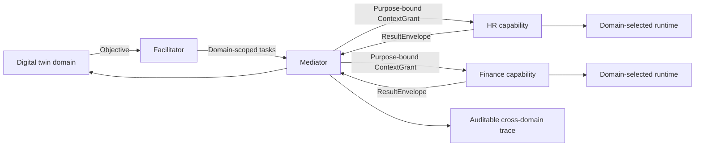

# HEnRY

[](https://github.com/2mmanu/henry/actions/workflows/ci.yml?query=branch%3Anext)
[](https://www.python.org/)
[](LICENSE)
[](https://arxiv.org/abs/2410.12720)

**Make organizational boundaries executable in multi-agent systems.**

HEnRY is a domain governance layer for systems where agents must collaborate without collapsing
HR, finance, legal, healthcare or personal context into one shared prompt. It turns domain
ownership, capability contracts, purpose limitation and controlled context sharing into enforceable
runtime decisions.

HEnRY is provider-neutral. OmniAgent is the default execution adapter today; the original research
prototype used MemGPT/Letta.

> **Status: alpha.** The governed execution path is implemented and tested. Durable storage,
> production identity and complete facilitator/mediator workflows remain on the roadmap.

## The problem

Organizations are not one knowledge base with one trust boundary. They are made of domains—such as
HR, finance, legal or operations—with different owners, data, tools, policies and access rules. A
request may need several of those domains, while no participant should automatically see the full
user context or another domain's internal state.

The usual approaches force an unsafe trade-off:

| Approach | What breaks as domains grow |
| --- | --- |
| One assistant per domain | Users face multiple portals; teams duplicate infrastructure; cross-domain work stays manual |
| One centralized assistant | It becomes over-privileged; ownership blurs; sensitive context accumulates; execution becomes hard to audit |
| Provider-specific integrations | Capabilities and governance become coupled to a runtime, slowing replacement and reuse |

The hard problem is therefore not simply routing a prompt to several agents. It is letting one task
cross organizational boundaries while every domain retains authority over its capabilities and data,
only the minimum authorized context is disclosed, and every delegation and result remains
reconstructable.

HEnRY addresses this as a governance problem above the execution runtime. Read the full
[problem statement](docs/problem.md).

## Why HEnRY?

Most agent frameworks answer **how to run an agent**. HEnRY answers the organizational questions
that come first:

| Question | HEnRY answer |
| --- | --- |
| Who owns this data and capability? | A versioned, sovereign domain |
| Which agent may act? | The agent behind an authorized capability contract |
| Why may context be used? | An explicit purpose evaluated by policy |
| What may cross a boundary? | A minimal, expiring visibility cone |
| How do domains collaborate? | Facilitated tasks and mediated exchanges |
| Can execution be reconstructed? | Correlated task, policy, grant, runtime and audit records |

Agents and providers are replaceable implementation details. Domain sovereignty and governance
remain stable when either changes.

## Core model

- **Domains own boundaries.** Each domain controls its policies, classifications, capabilities,
  agents, data residency and internal memory.
- **Capabilities are the public API.** Other domains request a versioned business capability, not
  unrestricted access to an agent or its tools.
- **Context is private by default.** HEnRY projects only fields authorized for the declared purpose
  and capability.
- **Facilitators coordinate, mediators govern.** Planning never grants universal access; every
  cross-domain exchange remains policy-controlled and traceable.
- **Execution is pluggable.** Runtime adapters submit already-authorized work to OmniAgent or another
  provider without moving governance into that provider.



## See it in five minutes

The demo runtime is deterministic and requires no model credentials.

```bash
git clone --branch next https://github.com/2mmanu/henry.git
cd henry
python3 -m venv .venv
source .venv/bin/activate
python3 -m pip install -e '.[dev]'
HENRY_RUNTIME=demo HENRY_API_KEY=local-demo-key henry-control
```

Open [http://127.0.0.1:8090](http://127.0.0.1:8090). The dashboard submits an HR task containing a
role and a candidate name, but grants only the role. The result shows that the execution provider
received the authorized projection while the candidate identity stayed outside its visibility cone.

From another terminal, the same flow is available as code:

```bash
source .venv/bin/activate
python examples/submit_governed_task.py
```

Read the [getting started guide](docs/getting-started.md) for the API request and expected trace.

## What exists today

| Ready to explore | Planned production work |
| --- | --- |
| Typed domain, capability, agent, task, context and result contracts | Durable tenant-isolated repositories |
| Default-deny entitlement, purpose and classification policy | OIDC and workload identity |
| Field-level, expiring context grants | Distributed policy and approval workflows |
| Task state machine, idempotency and audit chain | Full facilitator and mediator services |
| Demo and OmniAgent runtime adapters | Additional provider conformance adapters |
| FastAPI control plane and local dashboard | Distributed tracing and operational hardening |

The in-memory registry, task repository and ledger are intentionally pilot components. Do not treat
the development API-key identity adapter as a production security boundary.

## Execution providers

| Provider | Role | Status |
| --- | --- | --- |
| Demo | Deterministic local governance walkthrough | Included |
| OmniAgent | Sessions, workers, models and tools | Default adapter |
| MemGPT/Letta | Runtime used by the original HEnRY prototype | Historical integration |
| Other providers | Implement the `ExecutionRuntimePort` contract | Extension point |

See [provider adapters](docs/providers/README.md) for the extension contract.

## Repository map

```text
henry/contracts/       Domain, capability, task, context and result contracts
henry/policy/          Default-deny authorization decisions
henry/context/         Visibility cones and context grants
henry/tasks/           Task lifecycle, graph and orchestration service
henry/runtime/         Provider-neutral port plus runtime adapters
henry/audit/           Tamper-evident audit events
apps/control_plane/    FastAPI API and local dashboard
examples/              Minimal runnable client flows
docs/                  Concepts, architecture, providers and design history
tests/                 Unit and integration coverage
```

## Documentation

- [Documentation map](docs/README.md)
- [Problem statement](docs/problem.md)
- [Getting started](docs/getting-started.md)
- [Domains and sovereignty](docs/concepts/domains.md)
- [Controlled context sharing](docs/concepts/context-sharing.md)
- [Architecture overview](docs/architecture/overview.md)
- [Provider adapters](docs/providers/README.md)
- [Roadmap](ROADMAP.md)

## Community

Run `make check` before opening a pull request. Architectural changes should explain their impact on
domain sovereignty, visibility, policy and auditability.

- [Contributing](CONTRIBUTING.md)
- [Security policy](SECURITY.md)
- [Code of conduct](CODE_OF_CONDUCT.md)
- [Changelog](CHANGELOG.md)

## Citation

```bibtex
@article{lacavalla2024henry,
  title={HEnRY: A Multi-Agent System Framework for Multi-Domain Contexts},
  author={Lacavalla, Emmanuele and Yang, Shuyi and Crupi, Riccardo and Gonzalez, Joseph E.},
  journal={arXiv preprint arXiv:2410.12720},
  year={2024}
}
```

Apache-2.0 licensed. See [LICENSE](LICENSE) and [NOTICE](NOTICE).
